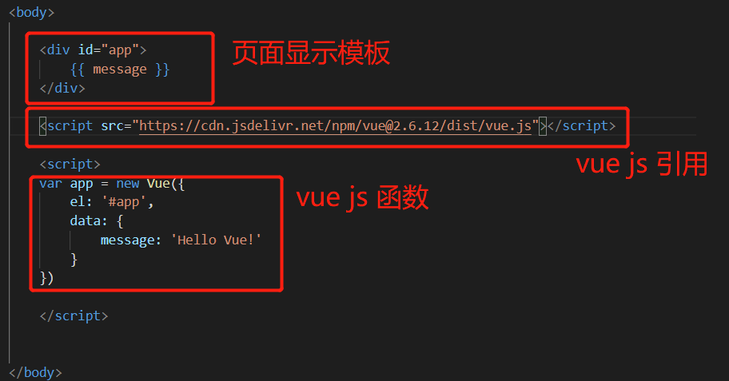

vue本质是个js框架，所以只要引用了vue.js文件就可以编写vue程序。
参见 1.html

## 1.创建一个简单的HTML页面模板
```
<div id="app">
    {{ message }}
</div>
```

## 2.创建一个vue的实例

```
<script>
var app = new Vue({
    el: '#app',
    data: {
        message: 'Hello Vue!'
    }
})
```

## 3. 一个完整的例子



## 运行流程解析

1. js函数首先会new 一个Vue实例，这个实例会接受一个对象{}作为参数。
   
2. 这个参数简单的包含如下
   *  el: -- 用来在html中找到div的id的名称
   *  data: -- 一个data对象，包含一些初始化变量的值。
   *  methods: -- 一个函数列表对象，包含一些定义的函数。

3. vue定义了一套模板替换语法，定义在html中，让后vue通过定义的变量值来替换html中毒的模板变量。例如：
   * {{ msg }} -- 显示变量
   * v-if -- 条件
   * v-for -- 循环
 * 

Vue实例运行后，会通过 el: '#app' 找到dom中的模板，然后会将{{ message }}用 message: 'Hello Vue!'来替换。

所以这个时候引入的是需要包含编译的完整版vue.js

```
// 需要编译器
new Vue({
  template: '<div>{{ hi }}</div>'
})

// 不需要编译器
new Vue({
  render (h) {
    return h('div', this.hi)
  }
})
```