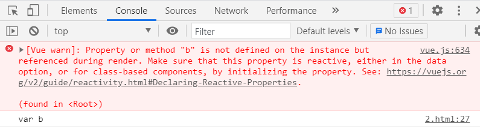
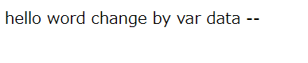

## Vue 实例

当一个 Vue 实例被创建时，它将 data 对象中的所有的 property 加入到 Vue的响应式系统中。当这些 property 的值发生改变时，视图将会产生“响应”，即匹配更新为新的值。
原理就是vue为所有的property加入了set和get方法，当设置property的值时，就会调用set方法，然后调用dom更新，达到试图会产生“响应”的效果。

## 一个简单例子

1. 创建一个简单的HTML页面模板
```
<div id="app">
    {{ a }} --- {{ b }}
</div>
```

2. 创建一个vue的实例
我们在创建vue的实例前，先创建一个data变量，
<font color='red'>值得注意的是只有当实例被创建时就已经存在于 data 中的 property 才是响应式的。也就是说如果你添加一个新的 property，比如：b,那么对 b 的改动将不会触发任何视图的更新。</font>

```
<script>
    var data = {
        a:"hello define by first",
    }

    var vm = new Vue({
        el: '#app',
        data: data
    })

    data.b="var b"
    console.log(data.b)
   // 获得这个实例上的 property
    // 返回源数据中对应的字段
    console.log(vm.a == data.a) // => true
</script>
```
结果显示如下



因为在创建vue的实例前没有定义变量b,所以即使在vm实例后再给data.b赋值，视图不会更新。但是符合js语法，所有log中能打出来。


## 改变data.a属性

```
<script>
    var data = {
        a:"hello define by first",
    }

    var vm = new Vue({
        el: '#app',
        data: data
    })

    data.b="var b"
    console.log(data.b)
    // 设置 原始数据 会影响到property
    data.a="hello word change by var data"

   
</script>
```

结果显示如下

这也就是只要data.a变化了，页面也会跟着变化。

## 改变vm.a属性

```
<script>
    var data = {
        a:"hello define by first",
    }

    var vm = new Vue({
        el: '#app',
        data: data
    })

    data.b="var b"
    console.log(data.b)
    data.a="hello word change by var data"
    // 反之 设置property也会影响到原始数据 
    vm.a="hello word change by vm"

    
</script>
```
结果显示如下


## Object.freeze()

使用 Object.freeze()，这会阻止修改现有的 property，也意味着响应系统无法再追踪变化。

```
var data = {
    a:"hello define by first",
}

Object.freeze(data)

var vm = new Vue({
    el: '#app',
    data: data
})
```
结果显示如下
